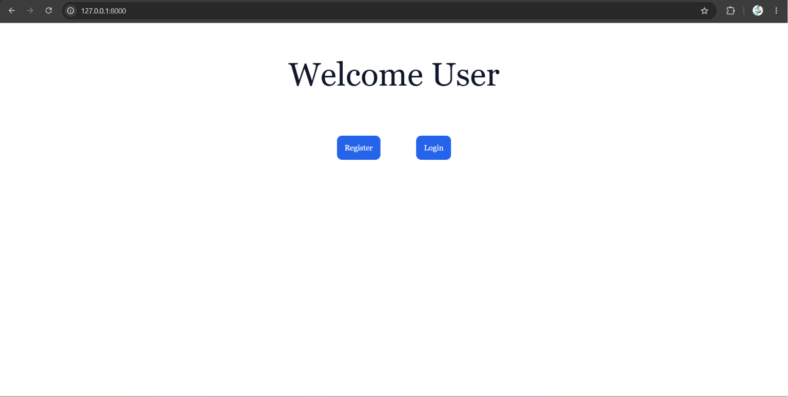
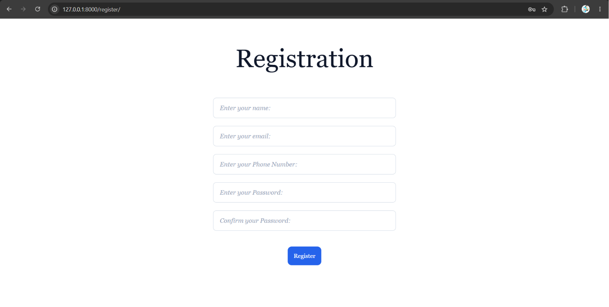
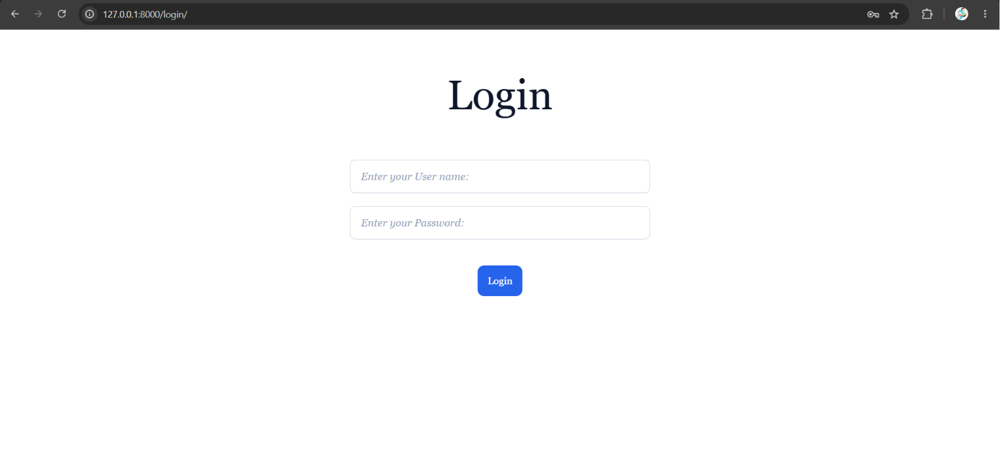
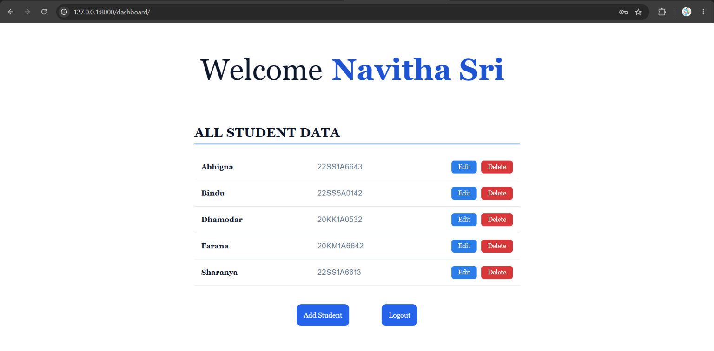
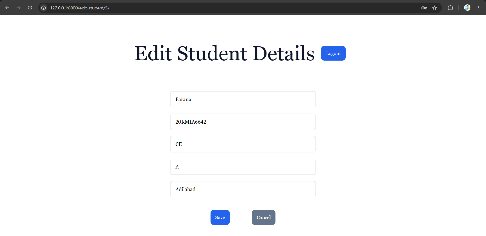
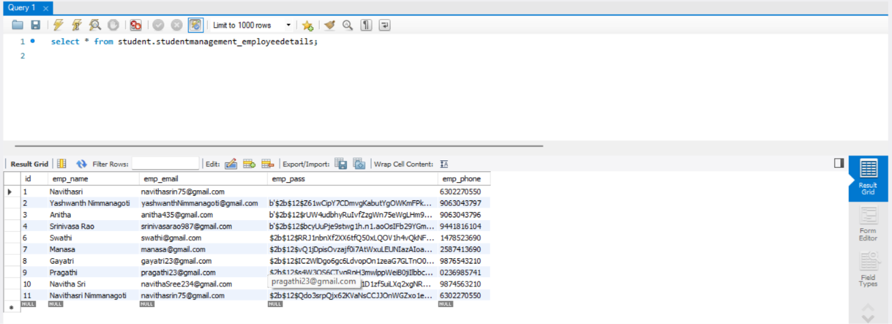
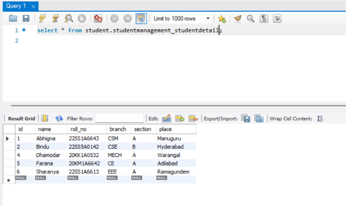

# 🎓 Campus Vault


A secure and user-friendly **Student Management System** built using **Django, HTML, CSS, JavaScript, MySQL, Django REST Framework Serializers, bcrypt Password Hashing, Cookies Authentication, and Environment Variables**.

Campus Vault enables secure user authentication and efficient student record management through a clean and intuitive interface.

---

## 🚀 Features

### 🔐 Authentication
- User Registration
- Secure Login
- Logout
- Password Hashing using **bcrypt**
- Cookie-Based Authentication
- Duplicate Username Validation
- Password Confirmation Validation

### 🎓 Student Management
- Add Student
- View Student Records
- Edit Student Details
- Delete Student Records
- Dashboard displaying all students

### ✅ Data Validation
- Django REST Framework Serializers
- Username Validation
- Phone Number Validation
- Student Data Validation

### 🗄️ Database
- MySQL Database Integration
- ORM-based Database Operations

### 🔒 Security
- Environment Variables (.env)
- Password Hashing
- Protected Dashboard Access
- Cookie Session Management

---

# 🛠️ Tech Stack

| Technology | Purpose |
|------------|---------|
| HTML5 | Structure |
| CSS3 | Styling |
| JavaScript | Client-side Interactivity |
| Python | Backend Programming |
| Django | Web Framework |
| Django REST Framework | Serializers & Validation |
| MySQL | Database |
| bcrypt | Password Hashing |
| django-environ | Environment Variables |
| Cookies | Authentication |

---

# 📂 Project Structure

```text
Campus-Vault/
│
├── manage.py
├── requirements.txt
├── README.md
├── .gitignore
├── .env.example
│
├── Student/
│   ├── settings.py
│   ├── urls.py
│   ├── wsgi.py
│   └── asgi.py
│
├── StudentManagement/
│   ├── migrations/
│   ├── admin.py
│   ├── models.py
│   ├── serializer.py
│   ├── password.py
│   ├── urls.py
│   └── views.py
│
├── templates/
├── static/
└── screenshots/
```

---

# ⚙️ Installation

## Clone Repository

```bash
git clone https://github.com/Navitha55/Campus-Vault.git
```

---

## Navigate to Project

```bash
cd Campus-Vault
```

---

## Create Virtual Environment

### Windows

```bash
python -m venv venv
```

Activate

```bash
venv\Scripts\activate
```

### Linux / macOS

```bash
python3 -m venv venv
source venv/bin/activate
```

---

## Install Dependencies

```bash
pip install -r requirements.txt
```

---

## Configure Environment Variables

Create a file named

```
.env
```

Copy the contents from

```
.env.example
```

Example

```env
SECRET_KEY=your-secret-key

DEBUG=True

DB_ENGINE=django.db.backends.mysql
DB_NAME=student
DB_USER=root
DB_PASSWORD=your_password
DB_HOST=localhost
DB_PORT=3306
```

---

## Create MySQL Database

```sql
CREATE DATABASE student;
```

---

## Apply Migrations

```bash
python manage.py migrate
```

---

## Run Server

```bash
python manage.py runserver
```

Open your browser and visit

```
http://127.0.0.1:8000/
```

---

# 📸 Project Screenshots

## 🏠 Home Page



---

## 📝 Registration Page



---

## 🔑 Login Page



---

## 📊 Dashboard



---

## ✏️ Edit Student Details



---

## 🗄️ Employee Database



---

## 🗄️ Student Database



---

# 🗄️ Database Schema

## EmployeeDetails

- Employee Name
- Employee Email
- Employee Phone
- Encrypted Password

## StudentDetail

- Student Name
- Roll Number
- Branch
- Section
- Place

---

# 🔐 Authentication Workflow

1. Register a new account.
2. Password is securely hashed using **bcrypt**.
3. Login with valid credentials.
4. Cookies maintain the authenticated session.
5. Access the protected dashboard.
6. Perform CRUD operations on student records.
7. Logout to clear the session.

---

# 📦 Dependencies

- Django
- Django REST Framework
- django-environ
- bcrypt
- mysqlclient

---

# 🌱 Future Enhancements

- Django Authentication System
- JWT Authentication
- Role-Based Access Control
- Student Search & Filter
- Pagination
- Profile Images
- Password Reset
- REST API Endpoints
- Docker Support
- Deployment on Render / Railway

---

# 👩‍💻 Author

**Navitha Sri**

📧 Email: **navithasrin75@gmail.com**

🐙 GitHub: https://github.com/Navitha55


## ⭐ If you found this project useful, please consider giving it a Star!